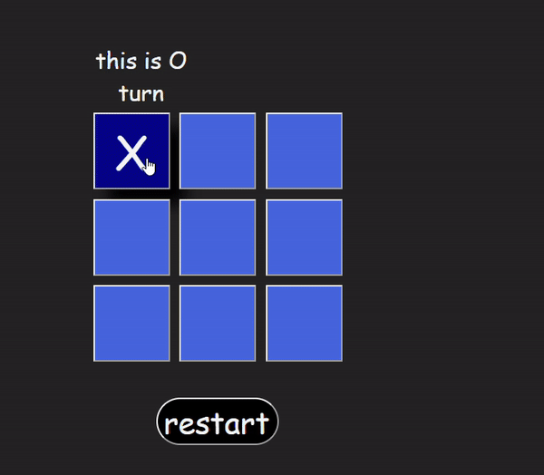
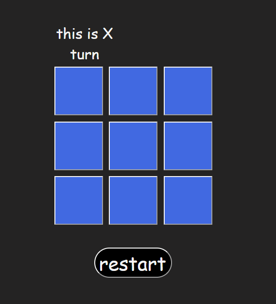
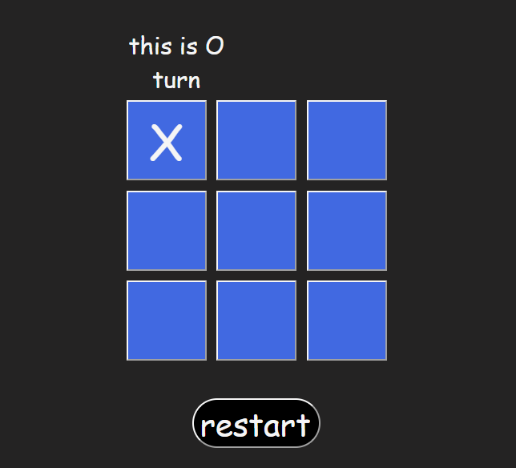
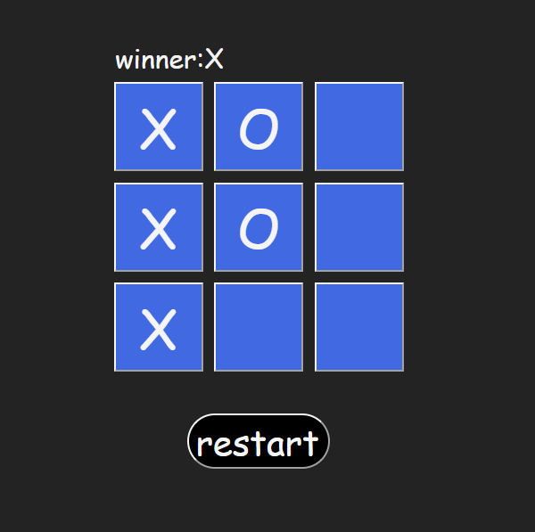

# Tic-Tac-Toa (React version)

## Date: 30/6/2024

### By: Hussain Al Aradi

#### [Gmail](hussainAlAradi.ha@gmail.com) | [GitHub](https://github.com/HussainALAradi5) | [LinkedIn](https://www.linkedin.com/in/hussain-ahmed-ali-al-aradi-292182292/)

---

### **_Description_**

#### this project is same as the previous tic tac toa i made, but this one with the react framework

---

### **_Technologies Used_**

- JS(the programming language)
- React
- vite for creating the nice template for the React
- CSS(for design)
- HTML

---

### **_Getting Started_**

##### just play the game and enjoy it

## this is the link for the game [XO](https://tic_tac_toa.surge.sh/)

### **_Screenshots_**

##### image header 1

## 

##### image header 2

### **_Future Updates_**

- [x] player can play with X and O
- [x] show whos turn now
- [x] have rest button to rest the game
- [x] the game stop if any of the parties win
- [ ] tie

---

### **_Credits_**

##### my instructors who give me the previous tic-tac-toa homework to do it, they inspired me to challenge myself and do it again with React

---
